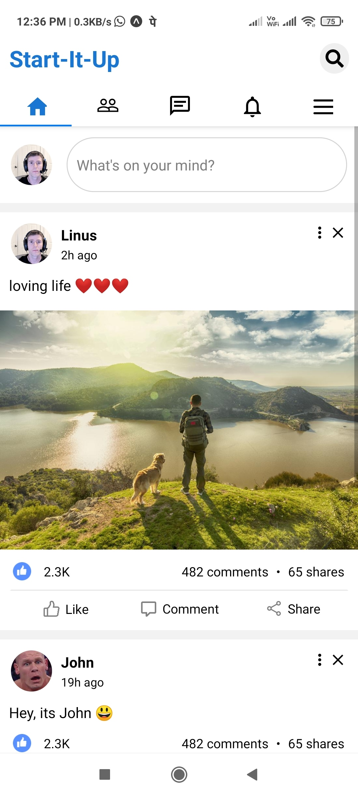

# Social-Media-App

An app to connect with developers all across the world and work with them on new ideas 💡

## Run Locally

Clone the project

```bash
  git clone https://github.com/SrijanDas/social-media-app.git
```

Go to the project directory

```bash
  cd social-media-app
```

Install dependencies

```bash
  npm install
```

Start the server

```bash
  npm run start
```

## Screenshots


